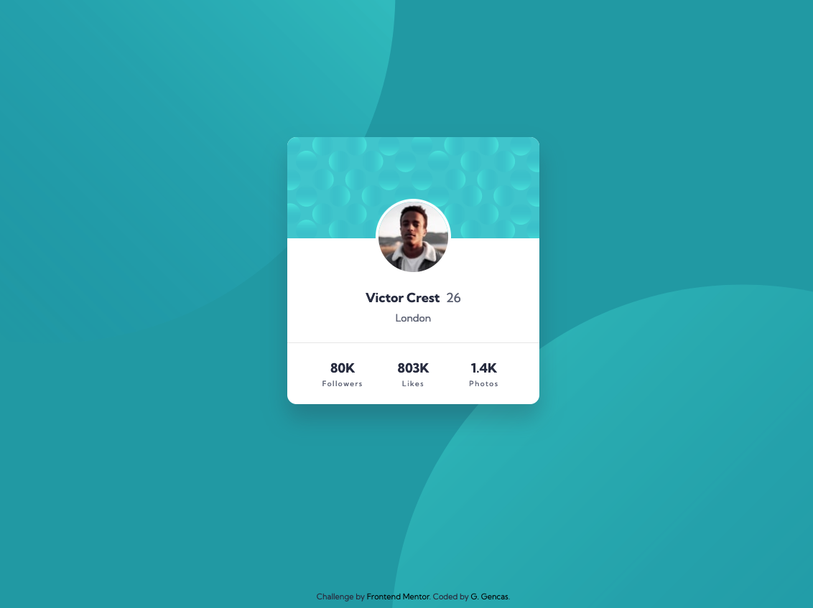
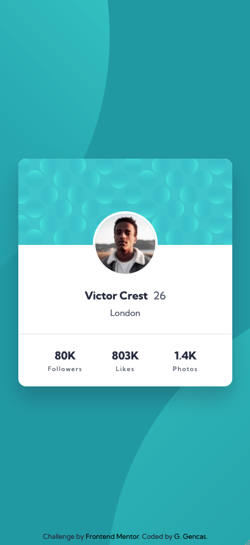

# Frontend Mentor - Profile card component solution

This is a solution to the [Profile card component challenge on Frontend Mentor](https://www.frontendmentor.io/challenges/profile-card-component-cfArpWshJ). Frontend Mentor challenges help you improve your coding skills by building realistic projects.

## Table of contents

- [Overview](#overview)
  - [The challenge](#the-challenge)
  - [Screenshot](#screenshot)
  - [Links](#links)
- [My process](#my-process)
  - [Built with](#built-with)
- [Author](#author)

## Overview

### The challenge

Users should be able to:

- View the optimal layout depending on their device's screen size

### Screenshot

### Links

- Solution URL: [https://www.frontendmentor.io/solutions/profile-card-component-with-css-flex-and-grid-yP2dvAkJ4a](https://www.frontendmentor.io/solutions/profile-card-component-with-css-flex-and-grid-yP2dvAkJ4a)
- Live Site URL: [https://ggencas.github.io/profile-card-component/](https://ggencas.github.io/profile-card-component/)

## My process

### Built with

- Semantic HTML5 markup
- CSS/Grid
- Flexbox

## Author

- GitHub - [ggencas](https://github.com/ggencas)
- Frontend Mentor - [@ggencas](https://www.frontendmentor.io/profile/ggencas)
- LinkedIn - [Gintaras Gencas](https://www.linkedin.com/in/gintaras-gencas/)
